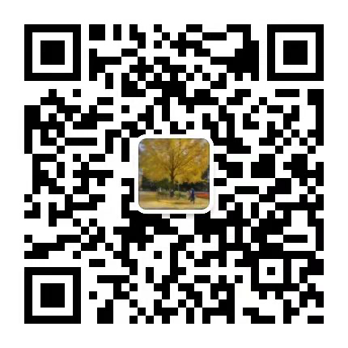

# 介绍:
机器学习的一些实践，这里有很多小项目以及比赛项目的代码，都是笔者个人写的，欢迎star，关于相关解读，可以关注如下博客和微信公众号，后期会主要更新微信公众号

# csdn:
https://blog.csdn.net/weixin_42001089?spm=1001.2101.3001.5343

# 知乎:
https://www.zhihu.com/people/sa-tuo-de-yisheng/posts

# 笔者微信公众号：
会定时将讲解部分同步到公众号，大家可以关注下～～

